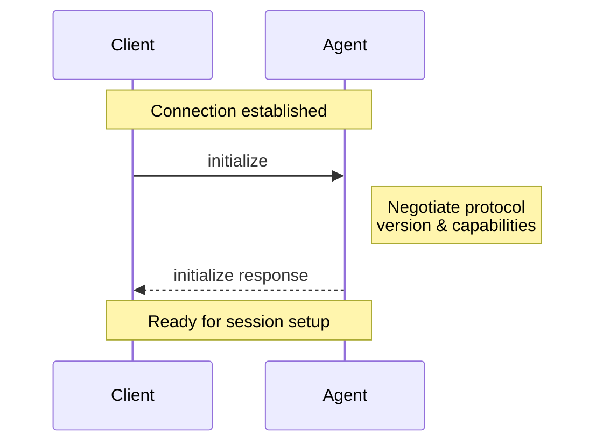

# Initialization

> How all Agent Client Protocol connections begin

The Initialization phase allows [Clients](./acp-overview#client) and [Agents](./acp-overview#agent) to negotiate protocol versions, capabilities, and authentication methods.



Before a Session can be created, Clients **MUST** initialize the connection by calling the `initialize` method with:

* The latest [protocol version](#protocol-version) supported
* The [capabilities](#client-capabilities) supported

They **SHOULD** also provide a name and version to the Agent.

```json
{
  "jsonrpc": "2.0",
  "id": 0,
  "method": "initialize",
  "params": {
    "protocolVersion": 1,
    "clientCapabilities": {
      "fs": {
        "readTextFile": true,
        "writeTextFile": true
      },
      "terminal": true
    },
    "clientInfo": {
      "name": "my-client",
      "title": "My Client",
      "version": "1.0.0"
    }
  }
}
```

The Agent **MUST** respond with the chosen [protocol version](#protocol-version) and the [capabilities](#agent-capabilities) it supports. It **SHOULD** also provide a name and version to the Client as well:

```json
{
  "jsonrpc": "2.0",
  "id": 0,
  "result": {
    "protocolVersion": 1,
    "agentCapabilities": {
      "loadSession": true,
      "promptCapabilities": {
        "image": true,
        "audio": true,
        "embeddedContext": true
      },
      "mcp": {
        "http": true,
        "sse": true
      }
    },
    "agentInfo": {
      "name": "my-agent",
      "title": "My Agent",
      "version": "1.0.0"
    },
    "authMethods": []
  }
}
```

## Protocol version

The protocol versions that appear in the `initialize` requests and responses are a single integer that identifies a **MAJOR** protocol version. This version is only incremented when breaking changes are introduced.

Clients and Agents **MUST** agree on a protocol version and act according to its specification.

See [Capabilities](#capabilities) to learn how non-breaking features are introduced.

### Version Negotiation

The `initialize` request **MUST** include the latest protocol version the Client supports.

If the Agent supports the requested version, it **MUST** respond with the same version. Otherwise, the Agent **MUST** respond with the latest version it supports.

If the Client does not support the version specified by the Agent in the `initialize` response, the Client **SHOULD** close the connection and inform the user about it.

## Capabilities

Capabilities describe features supported by the Client and the Agent.

All capabilities included in the `initialize` request are **OPTIONAL**. Clients and Agents **SHOULD** support all possible combinations of their peer's capabilities.

The introduction of new capabilities is not considered a breaking change. Therefore, Clients and Agents **MUST** treat all capabilities omitted in the `initialize` request as **UNSUPPORTED**.

Capabilities are high-level and are not attached to a specific base protocol concept.

Capabilities may specify the availability of protocol methods, notifications, or a subset of their parameters. They may also signal behaviors of the Agent or Client implementation.

Implementations can also [advertise custom capabilities](./acp-extensibility#advertising-custom-capabilities) using the `_meta` field to indicate support for protocol extensions.

### Client Capabilities

The Client **SHOULD** specify whether it supports the following capabilities:

#### File System

- **`readTextFile`** (`boolean`): The `fs/read_text_file` method is available.
- **`writeTextFile`** (`boolean`): The `fs/write_text_file` method is available.

> 📄 [Learn more about File System methods](./acp-file-system)

#### Terminal

- **`terminal`** (`boolean`): All `terminal/*` methods are available, allowing the Agent to execute and manage shell commands.

> 💻 [Learn more about Terminals](./acp-terminal)

### Agent Capabilities

The Agent **SHOULD** specify whether it supports the following capabilities:

- **`loadSession`** (`boolean`, default: `false`): The [`session/load`](./acp-session-setup#loading-sessions) method is available.
- **`promptCapabilities`** (`PromptCapabilities Object`): Object indicating the different types of [content](./acp-content) that may be included in `session/prompt` requests.

#### Prompt capabilities

As a baseline, all Agents **MUST** support `ContentBlock::Text` and `ContentBlock::ResourceLink` in `session/prompt` requests.

Optionally, they **MAY** support richer types of [content](./acp-content) by specifying the following capabilities:

- **`image`** (`boolean`, default: `false`): The prompt may include `ContentBlock::Image`
- **`audio`** (`boolean`, default: `false`): The prompt may include `ContentBlock::Audio`
- **`embeddedContext`** (`boolean`, default: `false`): The prompt may include `ContentBlock::Resource`

#### MCP capabilities

- **`http`** (`boolean`, default: `false`): The Agent supports connecting to MCP servers over HTTP.
- **`sse`** (`boolean`, default: `false`): The Agent supports connecting to MCP servers over SSE. Note: This transport has been deprecated by the MCP spec.

#### Session Capabilities

As a baseline, all Agents **MUST** support `session/new`, `session/prompt`, `session/cancel`, and `session/update`.

Optionally, they **MAY** support other session methods and notifications by specifying additional capabilities.

> **Note:** `session/load` is still handled by the top-level `load_session` capability. This will be unified in future versions of the protocol.

## Implementation Information

Both Clients and Agents **SHOULD** provide information about their implementation in the `clientInfo` and `agentInfo` fields respectively. Both take the following three fields:

- **`name`** (`string`): Intended for programmatic or logical use, but can be used as a display name fallback if title isn't present.
- **`title`** (`string`): Intended for UI and end-user contexts — optimized to be human-readable and easily understood. If not provided, the name should be used for display.
- **`version`** (`string`): Version of the implementation. Can be displayed to the user or used for debugging or metrics purposes.

> **Note:** In future versions of the protocol, this information will be required.

---

Once the connection is initialized, you're ready to [create a session](./acp-session-setup) and begin the conversation with the Agent.

---

> To find navigation and other pages in this documentation, fetch the llms.txt file at: https://agentclientprotocol.com/llms.txt